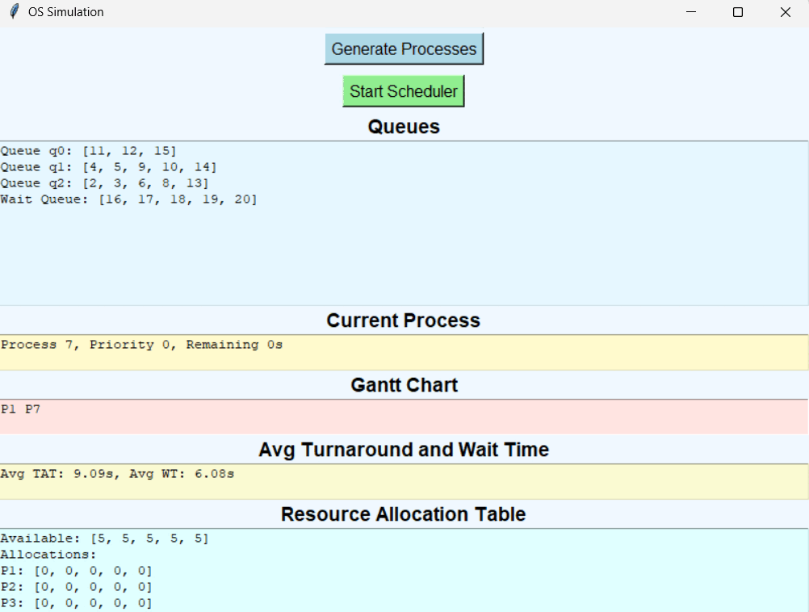

# OSProcessSchedulerSimulator

GUI based simulator for generic process scheduler/deadlock manager suite for an operating system.

## Badges

 

## Authors

- [@usmanawan50](https://github.com/usmanawan50/usmanawan50.git)

## Deployment(om Windows)

To deploy this project, you must have installed python3 and download main.py. Then follow these steps: 

1. Open python IDLE. 
2. Go to File and open main.py. 
3. Run module by pressing F5 or from the Run menu.

## FAQ

#### How to use the simulator?

Generate processes with randomized attributes and start/stop scheduler as you like. Observe current process, gantt chart, wait time and turnaround time.

#### How does the scheduling and deadlock handling work?

The scheduling is done by implementing a multiqueue system. Processes are inserted in queue using priority scheduling and given cpu using time slicing algorithm.

## Usage/Examples

